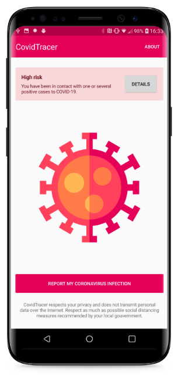
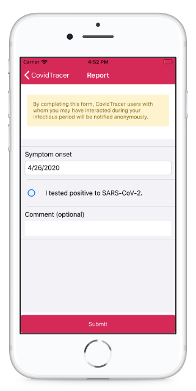

# CovidTracer

CovidTracer is a heavily **decentralized** and **anonymous** contact tracing application designed for the ongoing COVID-19 pandemic.

CovidTracer notifies users of any close contact with other users diagnosed with COVID-19. 

 

CovidTracer uses Bluetooth and cryptographic techniques to protect user privacy. App users do not share personal data. GPS location is never recorded.

CovidTracer follows the [contact tracing recommendations](https://www.eff.org/deeplinks/2020/04/challenge-proximity-apps-covid-19-contact-tracing) of the Electronic Frontier Foundation.

CovidTracer is a free and open-source software (GPLv3).

## Download and installation

Google and Apple are [currently not allowing](https://www.theverge.com/2020/3/5/21167102/apple-google-coronavirus-iphone-apps-android-misinformation-reject-ban) any coronavirus-related app that are not from recognized health organizations or governments on their stores. The app can still be installed using alternative channels:

On **Android**, an installable APK can be downloaded [here](releases/android/covidtracer_0.1.apk?raw=true).

On **iOS**, only registered Apple developpers can build, sign and install the app on their iPhones. This can be done by cloning this repository and by using [Visual Studio for macOS](https://visualstudio.microsoft.com/vs/mac/). The iOS app does not support all features yet. 

## Frequently asked questions

- **What are the privacy features of CovidTracer?**
CovidTracer uses cryptographic techniques similar to those used by e-commerce and crypto currencies. These provide an high degree of privacy that prevents anyone to associate the use of the app with any of your personal data (location, name...).

- **When should I use CovidTracer?**
For maximum efficiency, opens the app or let it run in background when you interact with people external to your household (transports, office, grocery stores, outdoor activities...).

- **What to do when the app detects a high-risk contact?**
Please inform your general practitioner as soon as possible about the high-risk contact the app detected. The app does not notify any health or governmental organization on positive match.

- **Why is the Android application requesting access to my location?**
Android app must [request the location permission](https://developer.android.com/guide/topics/connectivity/bluetooth#Permissions) to access some Bluetooth features, such as scanning. CovidTracer does not use or record your location.

- **How can I remove any data recorded by the app?**
Un-installing the application from your smartphone will delete all data the app recorded. If you ever reported yourself as a positive case, some (anonymous) data associated to your infectious perdiod will still be availaible to other app users.

- **I like the project, how can I help?** 
I am developping the app as a personal side-project with few resources. I would very much welcome any help.
    - If you speak a foreign language, you can help by translating [one of the localization files](CovidTracer/Resx/);
    - If you have some skills in computer science and/or cryptography, do not hesitate to read the technical details and to provide feedback;
    - If you are a graphic and/or UX designer, you can help by improving some of the UI components of the application (onboarding, icons...);
    - Creating an anonymous and (moslty) distributed contact-tracing application is possible. Please pressure your local gouvernment to take privacy into account if they are developing their own contact tracing systems.

## Technical details

### Overview

The app constantly broadcasts a unique 20 bytes identifier over Bluetooth Low Energy to nearby devices. This identifier is randonly generated (thus can not be associated with personal information) and is renewed every hour (preventing long-term tracking). Nearby CovidTracer users constantly record these identifiers in a database located on their devices. These identifiers are not shared with any central server or entity.

If the user ever reports her/himself as positive to SARS-CoV-2, the hourly-generated identifiers coresponding to the infectious period (16 days) are anonymously published on a central server. Other app users can then compare these identifiers with the ones they recorded over the past few days.

### Details

When the app is started for the first time, a [256 bits key is generated](CovidTracer/Models/Keys/TracerKey.cs#L54) using a cryptographic random number generator:

    TracerKey = RNG()

This key will not be shared with other app users but will be used to derivate daily and hourly keys.

Every (UTC) day, [a new 256 bits key is derived](CovidTracer/Models/Keys/TracerKey.cs#L80) from the `TracerKey` using a *SHA-256 HMAC* function, together with the current date (as an ISO 8601 string):

    DailyKey = HMAC-SHA256(TracerKey, CurrentDate('YYYY-MM-DD'))
    
The original `TracerKey` can not be derived back from the `DailyKey`. 

The actual indentifier broadcasted over Bluetooth [is derived](CovidTracer/Models/Keys/DailyTracerKey.cs#L49) every (UTC) hour from the current day' key and current time. As Bluetooth Low Energy characteristics are limited to 20 bytes, this key is also truncated:

    CurrentKey = TRUNCATE(HMAC-SHA256(DailyKey, CurrentTime('YYYY-MM-DDTHH'))

If a user reports her/himself positive to SARS-CoV-2, all the generated daily identifiers used/to be used during the infectious period will be [shared with a central server](https://covid-tracer-backend.herokuapp.com/cases.json) (from 5 days before the symptoms onset, up to 11 days after). Other application instances can then derivate all hourly generated keys during the infectious period, and potentially match then with any contact they previously had. 

Additional measures have been taken to increase privacy:

- Contact tracing keys are automatically removed from the phone after 15 days;
- The backend returns daily keys in alphabetical order, and only publishes them every 12 hours. This makes it harder to associate multiple daily keys with a single user;
- The backend does not publish daily keys of future dates, and the apps only match contacts that occured on the day associated with the key. This prevents user impersonification; 
- Bluetooth signal quality is used to evaluate proximity of nearby devices. The algorithm is calibrated to only record identifiers of devices located in the same room;
- The backend implements strict rate-limiting on reporting;
- All communication with the backend is done over HTTPS;
- The backend [is availaible](https://github.com/RaphaelJ/covid-tracer-backend) as a free and opensource software.

More advanced diagnostic and debugging information can be obtained directly in the application by tapping 10 times on the tracer key ID on the *About* page.
